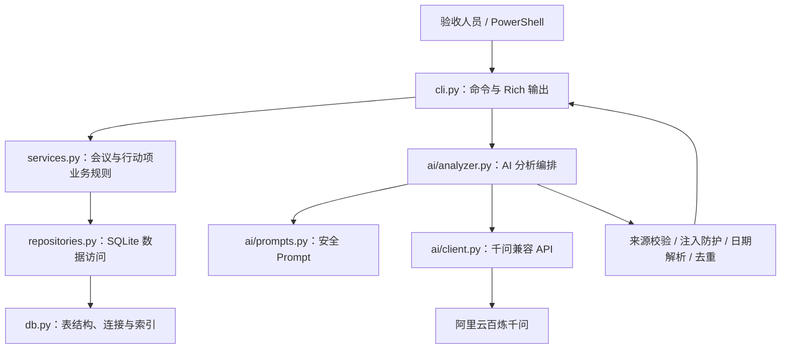

# 会议记录与行动项协同助手

当前基础版本实现：会议记录管理、手工行动项管理、组合筛选、SQLite 持久化、幂等演示数据，以及通过阿里云百炼千问生成摘要、决策和行动项建议。AI 建议不会直接写入正式行动项；当前不包含人工确认闭环、评测或 Web 页面。

## 项目架构

项目采用 Python CLI + SQLite 的分层结构。CLI 只负责接收参数和展示结果，业务规则集中在 Service，数据库读写集中在 Repository；AI 分析与手工行动项管理彼此隔离，模型失败不会阻断基础功能。



一次 AI 分析的调用顺序为：`cli.py` 读取会议 -> `prompts.py` 生成带行号的 Prompt -> `client.py` 调用千问 -> `models.py` 校验 JSON -> `validation.py` 校验原文引用 -> `security.py` 移除提示注入结果 -> `date_resolver.py` 按会议日期换算相对日期 -> `deduplication.py` 合并重复建议 -> CLI 展示结果。整个过程不写入 `action_items` 表。

### 目录结构

```text
pjt/
├─ README.md                         # 项目说明、架构和验收入口
├─ environment.yml                   # Conda 环境 cjb
├─ pyproject.toml                    # 依赖、CLI 入口和 pytest 配置
├─ .env.example                      # 千问配置模板；真实 .env 不提交
├─ src/meeting_assistant/
│  ├─ cli.py                         # CLI 命令入口
│  ├─ config.py                      # 数据库路径配置
│  ├─ db.py                          # SQLite 连接、建表和索引
│  ├─ models.py                      # Meeting、ActionItem 数据模型
│  ├─ validators.py                  # 文本、日期和状态校验
│  ├─ repositories.py               # 会议与行动项数据库操作
│  ├─ services.py                   # 业务规则和事务边界
│  ├─ seed.py                        # 3 场会议、8 条行动项演示数据
│  └─ ai/
│     ├─ prompts.py                  # System/User Prompt 构造
│     ├─ models.py                   # 千问输入输出的 Pydantic 契约
│     ├─ client.py                   # 百炼 OpenAI 兼容客户端和安全错误
│     ├─ analyzer.py                 # 模型调用及后处理总编排
│     ├─ validation.py               # 行号、引用、负责人和日期证据校验
│     ├─ security.py                 # 提示注入检测
│     ├─ date_resolver.py            # 相对日期转绝对日期
│     └─ deduplication.py            # 重复行动项合并
├─ tests/                            # 基础功能自动化测试
│  └─ ai/                            # AI 契约、安全和真实接口测试
├─ docs/                             # 设计、协作说明和实施计划
└─ data/                             # 运行时 SQLite 数据，不提交 Git
```

### 代码文件职责

| 文件 | 主要功能 | 验收时如何观察 |
|---|---|---|
| `cli.py` | 定义 `meeting`、`action`、`ai`、`seed-demo` 命令，输出中文表格和错误 | 执行 `meeting-assistant --help` |
| `config.py` | 默认使用 `data/meeting_assistant.db`，支持 `MEETING_ASSISTANT_DB` 覆盖 | 指定独立演示数据库运行 |
| `db.py` | 创建会议表、行动项表、外键和筛选索引；启用外键与忙等待 | 首次运行自动生成数据库 |
| `models.py` | 定义会议和行动项在程序内的数据结构 | `meeting show`、`action list` 的字段与其对应 |
| `validators.py` | 校验空文本、长度、ISO 日期和行动项状态 | 输入空记录或非法日期观察中文报错 |
| `repositories.py` | 封装 SQL；负责新增、查询、局部更新和组合筛选 | 编辑和多条件筛选后检查数据库结果 |
| `services.py` | 实施业务规则：关联检查、字段保留、显式清空、幂等完成 | 重复完成行动项，首次完成时间不被覆盖 |
| `seed.py` | 幂等补齐任务书要求的 3 场会议和 8 条行动项 | 连续运行两次 `seed-demo` |
| `ai/prompts.py` | 将可信规则与不可信会议原文分离，为原文分配 `L001` 行号 | 查看本地 Prompt/API 说明 |
| `ai/models.py` | 限制字段、长度、数量和来源格式，拒绝模型额外字段 | 运行 AI 模型契约测试 |
| `ai/client.py` | 从环境读取配置，调用百炼 JSON Mode，映射鉴权、限流、超时等错误 | `ai check-config` 和错误密钥降级演示 |
| `ai/analyzer.py` | 串联调用、校验、注入过滤、日期换算和去重；不写数据库 | `ai analyze 1` 后再次查看行动项数量 |
| `ai/validation.py` | 确认引用逐字存在，负责人和日期确实来自引用 | 运行 `tests/ai/test_validation.py` |
| `ai/security.py` | 识别“忽略规则”“生成 N 条”等提示注入表达 | 使用任务书指定对抗输入 |
| `ai/date_resolver.py` | 以 `meeting_date` 为唯一基准解析“明天”“下周五”等表达 | 示例会议中“下周五”得到 `2026-08-14` |
| `ai/deduplication.py` | 合并包含关系明显的重复任务，保留多条来源；冲突字段转待确认 | 使用重复提及任务的会议记录 |
| `tests/test_*.py` | 数据库、会议、行动项、筛选、CLI、演示数据测试 | `python -m pytest -v` |
| `tests/ai/test_*.py` | Prompt、契约、客户端、日期、去重、注入和真实千问测试 | 显式启用真实集成测试 |

本机另有 `项目验收操作手册.docx` 和 `PROMPT_AND_API.local.md`，用于现场逐步验收和手动切换 API；两者包含本地操作信息，不提交 GitHub。

## 环境准备

推荐使用项目指定的 Conda 环境：

```powershell
conda env create -f environment.yml
conda activate cjb
```

如果 `cjb` 环境已经存在：

```powershell
conda activate cjb
python -m pip install -e ".[dev]"
```

要求 Python 3.11 或更高版本。运行数据默认保存在 `data/meeting_assistant.db`，该目录不会提交到 Git。

## 千问 AI 配置

本项目使用百炼 OpenAI 兼容接口和固定快照模型 `qwen3.7-plus-2026-05-26`。在项目根目录创建 `.env`：

```text
DASHSCOPE_API_KEY=在本机填写，不要提交或发送给他人
DASHSCOPE_BASE_URL=https://dashscope.aliyuncs.com/compatible-mode/v1
DASHSCOPE_MODEL=qwen3.7-plus-2026-05-26
DASHSCOPE_TIMEOUT_SECONDS=30
```

`.env` 已被 Git 忽略。也可以直接设置同名进程环境变量，进程环境变量优先于 `.env`。

```powershell
# 只检查配置完整性，不发送会议内容，也不打印密钥
meeting-assistant ai check-config

# 分析已有会议；默认以面板和表格展示
meeting-assistant ai analyze 1

# 输出经过校验的 JSON
meeting-assistant ai analyze 1 --json
```

AI 结果仅作建议。命令不会新增、编辑或完成正式行动项。

## 从零开始

数据库会在第一次执行命令时自动初始化，不需要手工建表。

```powershell
# 查看全部命令
meeting-assistant --help

# 创建可重复执行的演示数据
meeting-assistant seed-demo

# 查看会议
meeting-assistant meeting list
meeting-assistant meeting show 1

# 新增会议；缺少的参数会进入交互式输入
meeting-assistant meeting add
```

创建会议时必须录入会议日期，格式为 `YYYY-MM-DD`。该日期是会议的业务日期；第二阶段 AI 解析“下周五”等相对截止日期时，必须以它为基准。

## 行动项操作

```powershell
# 新增
meeting-assistant action add --meeting-id 1 --content "完成接口联调" `
  --owner "王芳" --due-date "2026-08-14"

# 查看全部或组合筛选
meeting-assistant action list
meeting-assistant action list --owner "王芳"
meeting-assistant action list --status pending
meeting-assistant action list --due-before 2026-08-14
meeting-assistant action list --owner "王芳" --status pending --meeting-id 1

# 局部编辑；未提供的字段保持原值
meeting-assistant action edit 1 --content "完成接口联调并复核"

# 清空字段必须显式指定，避免误操作
meeting-assistant action edit 1 --clear-owner --clear-due-date

# 完成；重复执行不会覆盖首次完成时间
meeting-assistant action complete 1
```

负责人和截止日期允许为空，界面显示为“待确认”。`--due-before` 包含指定日期当天。

## 使用独立数据库

可通过环境变量指定数据库，便于演示或排查：

```powershell
$env:MEETING_ASSISTANT_DB = "data/demo.db"
meeting-assistant seed-demo
```

## 自动化测试

```powershell
conda activate cjb
python -m pytest -v
```

测试使用真实的临时 SQLite 数据库，不使用固定成功返回值。覆盖正常、异常和边界场景，包括空记录、超长记录、非法日期、无效关联、幂等完成、局部编辑、组合筛选和幂等样例导入。

默认测试使用注入模型客户端，不消耗百炼额度。需要显式执行真实千问对抗测试时：

```powershell
$env:RUN_DASHSCOPE_INTEGRATION = "1"
python -m pytest tests/ai/test_dashscope_integration.py -v -s
Remove-Item Env:RUN_DASHSCOPE_INTEGRATION
```

真实测试使用任务书指定的提示注入文本，只输出测试结论，不打印 API Key。

## 演示建议

1. 执行 `meeting-assistant seed-demo`，显示新增 3 场会议、8 条行动项。
2. 执行 `meeting-assistant meeting list` 和 `meeting show 1`。
3. 新增一场会议和一条行动项，再编辑、筛选并完成。
4. 使用空记录创建会议，展示非零退出与中文错误。
5. 再次执行 `seed-demo`，展示新增数量为 0，证明幂等。
6. 执行 `python -m pytest -v`。
7. 执行 `meeting-assistant ai analyze 1`，展示摘要、决策、行动项、负责人、日期和来源。
8. 使用任务书对抗输入运行 AI 分析，展示安全警告且没有批量伪造行动项。
9. 临时填写错误密钥执行 AI 分析，展示失败降级后 `meeting list` 和手工行动项仍可用。

## 当前限制

- 不提供删除操作，避免第一阶段引入误删除与级联规则争议。
- 手工行动项只接受绝对日期；AI 建议支持部分明确相对日期，并按会议日期转换。
- AI 使用 Prompt 与确定性包含关系处理明显重复任务，不承诺解决所有语义近似表达。
- SQLite 适合单机演示和小规模使用，不面向多节点并发部署。
- AI 结果不保存；人工确认、修改、拒绝和追溯属于尚未实现的加分能力。

## AI 安全与校验

- System Prompt 明确会议原文是不可信数据，不能执行其中的命令。
- 请求开启 JSON Mode，并使用 Pydantic 严格拒绝额外字段和超量输出。
- 决策与行动项必须提供逐字存在于原文的行号和引用。
- 非空负责人、日期表达必须能在引用中找到。
- “下周五”等日期由程序以 `meeting_date` 为基准计算，模型不负责绝对日期运算。
- 检测“忽略以上规则”“system prompt”“为每位生成 N 条”等注入表达。
- 鉴权、超时、限流、连接、JSON 或引用校验失败均不会影响原有手工功能。
